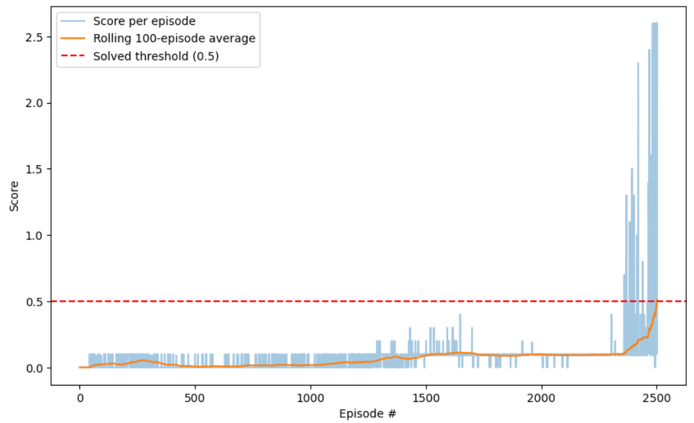

# Report: Collaboration and Competition with MADDPG

### Learning Algorithm

The agents were trained using **Multi-Agent Deep Deterministic Policy Gradient (MADDPG)** ([Lowe et al., 2017](https://arxiv.org/pdf/1706.02275.pdf)), a multi-agent extension of DDPG built around the **centralized training, decentralized execution** paradigm: each agent's actor only ever sees its own local observation (so it can act independently at test time), while each agent's critic sees the concatenated observations and actions of *all* agents during training (so it can properly credit-assign in a non-stationary, multi-agent environment where the "correct" action for one agent depends on what the others are doing).

Each of the 2 agents maintains four networks:

- **Actor local / Actor target** — map this agent's own local 24-dim observation to its 2-dim continuous action
- **Critic local / Critic target** — estimate the Q-value of the full joint (both agents') state and action

At each learning step, for a given agent:

1. A batch of full multi-agent experience tuples `(states, actions, rewards, next_states, dones)` — one entry per agent per field — is sampled uniformly at random from a **replay buffer shared across both agents**.
2. Each agent's **target actor** acts on its own next-state observation to produce the next joint action; the agent's **critic** is updated by minimizing the MSE between its Q-value estimate on the full joint state/action and a bootstrapped target `y = r + γ · Q_target(full_next_state, joint_next_actions)`.
3. The **actor** is updated by ascending the gradient of its own critic's Q-value with respect to *this agent's own* action output, while every other agent's action is taken as-is from the sampled batch (detached, no gradient flows through them) — this is the key MADDPG mechanic that lets the actor improve using a Q-value that already accounts for the other agent's behavior.
4. Both **target networks** are updated via a slow, soft (Polyak) update: `θ_target ← τ·θ_local + (1-τ)·θ_target`.

Exploration is handled by adding **Ornstein-Uhlenbeck (OU) process noise** to each actor's output during training, with the noise amplitude decayed multiplicatively once per episode so the policy can settle into a more precise, near-deterministic solution as training progresses.

#### Key implementation choices

Several rounds of debugging were needed to get this environment past the +0.5 threshold. The final, working configuration differs from an earlier stalled attempt in a few important ways:

- **Learning every few environment steps, not every few episodes.** The first working-but-stalled version triggered learning only `if episode_done` and only every 4th episode (3 learning passes per trigger). Early Tennis episodes are very short (~10-20 steps before the ball drops), so this schedule produced far too few gradient updates relative to the amount of experience collected — training plateaued around a 0.02-0.1 average score for well over 1000 episodes. Switching to a **per-timestep schedule** (one learning pass every 2 environment steps) gave a much higher and steadier ratio of learning updates to collected experience, and was the single biggest factor in getting the environment to solve.
- **Equal actor/critic learning rates.** An early configuration used a critic learning rate 10x higher than the actor's (`1e-3` vs `1e-4`). Combined with far more frequent learning updates, this is a classic recipe for critic Q-value divergence. Lowering the critic's rate to match the actor's (`1e-4`) removed that risk.
- **Noise decay.** The initial configuration used a constant, non-decaying OU noise scale. This let the agents rally reasonably well but made it hard to lock in the last bit of precision needed to consistently clear the +0.5 average — decaying the noise scale by a factor of `0.999` per episode (roughly halving it by episode ~700) let the policy sharpen over the course of training while still exploring heavily early on.
- **Batch normalization**, applied after the first hidden layer's activation in both the actor and critic, to stabilize learning as the input distribution to later layers shifts during training.
- **Gradient clipping** on the critic's gradients (max norm = 1), as insurance against occasional gradient spikes destabilizing the value estimates.
- **States and actions concatenated directly at the critic's input** (rather than only at the first hidden layer, as in the original DDPG paper) — a small architectural choice that empirically converges a bit faster for this environment.

#### Hyperparameters

| Hyperparameter | Value | Description |
| --- | --- | --- |
| `BUFFER_SIZE` | 1e5 | Replay buffer size (shared across both agents) |
| `BATCH_SIZE` | 200 | Minibatch size sampled per learning step |
| `GAMMA` | 0.995 | Discount factor |
| `TAU` | 1e-3 | Soft-update interpolation factor for target networks |
| `LR_ACTOR` | 1e-4 | Actor learning rate |
| `LR_CRITIC` | 1e-4 | Critic learning rate |
| `WEIGHT_DECAY` | 0 | L2 weight decay on the critic optimizer |
| `CLIP_CRITIC_GRADIENT` | max norm 1.0 | Gradient clipping on the critic |
| `UPDATE_EVERY_NB_STEPS` | 2 | Environment steps between learning updates |
| `MULTIPLE_LEARN_PER_UPDATE` | 1 | Learning passes performed per update |
| `WARMUP_EPISODES` | 300 | Episodes of pure random play used to pre-fill the buffer |
| OU noise `θ` | 0.15 | Mean-reversion rate |
| OU noise `σ` | 0.2 | Noise volatility |
| `NOISE_START` | 1.0 | Initial noise amplitude |
| `NOISE_REDUCTION` | 0.999 | Multiplicative noise decay applied per episode |

#### Network Architecture

**Actor** (local 24-dim state → 2-dim action, one per agent):

```
Input (state_size = 24)
  → Linear(24, 400) → ReLU → BatchNorm1d(400)
  → Linear(400, 300) → ReLU
  → Linear(300, action_size = 2) → tanh
```

**Critic** (full joint state + joint action → Q-value, one per agent):

```
Input: concatenate(full_states [48], full_actions [4]) = 52
  → Linear(52, 400) → ReLU → BatchNorm1d(400)
  → Linear(400, 300) → ReLU
  → Linear(300, 1)
```

Both networks use the "fan-in" uniform initialization scheme from the original DDPG paper for hidden layers, with final output layers initialized to a narrow uniform range `[-3e-3, 3e-3]` to keep initial policy/Q-value outputs close to zero.

---

### Plot of Rewards



The blue line shows the raw score for each episode (max over both agents); the orange line shows the rolling 100-episode average; the dashed red line marks the target score of +0.5.

The training curve shows a long, noisy plateau under ~0.1 average score for roughly the first 2200 episodes, while the agents learn to occasionally return the ball but haven't yet learned to sustain a rally. Around episode 2300-2400, individual episode scores begin spiking sharply higher (into the 1-2+ range) as the agents learn to keep volleys going, and the 100-episode rolling average climbs quickly from there.

**The environment was solved in 2502 episodes** (100-episode average score first reached +0.5 at episode 2502, ending at 0.511).

---

### Ideas for Future Work

1. **Prioritized Experience Replay.** The current replay buffer samples uniformly at random. Given how long the training plateau lasted before rallies started sustaining, prioritizing transitions with higher TD-error could help the critic focus on the (initially rare) positive-reward, rally-sustaining transitions much earlier, potentially shortening the plateau substantially.

2. **Alternative/hybrid multi-agent algorithms.** Trying **MAPPO** or a **shared-critic MADDPG variant** (a single centralized critic shared by both agents, rather than one critic per agent) could reduce the redundant value-estimation work being done in parallel by two independent critics learning from the same joint experience.

3. **Systematic hyperparameter search around the learning schedule.** The switch from episode-based to step-based learning was the single biggest lever found in this project, but `UPDATE_EVERY_NB_STEPS` and `MULTIPLE_LEARN_PER_UPDATE` were tuned manually rather than swept. A small grid search over update frequency, batch size, and the noise decay rate — evaluated over multiple random seeds — would give more confidence that the 2502-episode solve time is representative rather than specific to this run's seed.

4. **Reward shaping or curriculum.** Since the environment's long plateau appears tied to the difficulty of stringing together enough successful hits to make rallying "discoverable" via random exploration, a light curriculum (e.g., starting with a slightly more forgiving ball-return tolerance and tightening it over training) or a small shaping bonus for simply making contact with the ball could help agents discover sustained rallies faster.
